# Examples
This document gives an overview of the XML example files provided for illustrating the various `almaBTE` executables and their `xml` syntax.

The `.xml` files listed below can be found in the `/test_resources/examples` directory.

## Important Note / Disclaimer
The examples discussed in this manual are for illustration purposes only. 

**In particular, the wavevector grid employed in the examples is purposely coarse in order to speed up the process. For actual calculations we recommend the following minimal settings to ensure sufficiently converged thermal properties:**

- cubic systems (2 atoms per unit cell): `<gridDensity A="24" B="24" C="24">`
- wurtzites (4 atoms per unit cell): `<gridDensity A="15" B="15" C="15">`

<a name="toc"></a>
## Quick Navigation
- [`VCAbuilder`](#VCA)
- [`superlattice_builder`](#SL)
- [`kappa_Tsweep`](#Tsweep)
- [`cumulativecurves`](#cumul)
- [`kappa_crossplanefilms`](#crossplane)
- [`kappa_inplanefilms`](#inplane)
- [`steady_montecarlo1d`](#vrmc)
- [`steady_montecarlo1d_powersource`](#vrmcpower)
- [`transient_analytic1d`](#analytic)

<a name="VCA"></a>
## Example input files for `VCAbuilder`

- Example 1: [Monatomic single crystal](#VCA_ex1)
- Example 2: [Diatomic single crystal](#VCA_ex2)
- Example 3: [Binary alloy](#VCA_ex3)
- Example 4: [Ternary alloy](#VCA_ex4)
- Example 5: [Batch of varying compositions of binary alloy](#VCA_ex5)
- Example 6: [Batch of varying compositions of quaternary alloy with 1 free parameter](#VCA_ex6)
- Example 7: [Batch of varying compositions of quaternary alloy with 2 free parameters](#VCA_ex7)

[Back to navigation](#toc)
***
<a name="VCA_ex1">``VCAbuilder_example1.xml`` : Si</a>
 
```xml
<!-- Illustrates creation of a mono-atomic single crystal. -->

<singlecrystal>

  <!-- OPTIONAL. Specifies path to repository containing folders with force constants. -->
  <!-- Equals the current work directory when omitted. -->
  <materials_repository root_directory=".."/>

  <!-- Specify compound name within the repository. -->
  <compound name="Si"/>

  <!-- Specify desired number of divisions for wavevector grid. -->
  <gridDensity A="12" B="12" C="12"/>

  <!-- OPTIONAL. Specifies directory for writing HDF5 file. -->
  <!-- Will be determined automatically when omitted. -->
  <!-- (Name of HDF5 file is always created automatically.) -->
  <!-- Directory is relative to current work directory. -->
  <target directory="../Si"/>

  <!-- OPTIONAL. Forces rerun and rewrite even if HDF5 file already exists. -->
  <overwrite/>

</singlecrystal>
```
***
<a name="VCA_ex2">``VCAbuilder_example2.xml`` : GaAs</a> 

```xml
<!-- Illustrates creation of a bi-atomic single crystal. -->

<singlecrystal>

  <!-- OPTIONAL. Specifies path to repository containing folders with force constants. -->
  <!-- Equals the current work directory when omitted. -->
  <materials_repository root_directory=".."/>

  <!-- Specify compound name within the repository. -->
  <compound name="GaAs"/>

  <!-- Specify desired number of divisions for wavevector grid. -->
  <gridDensity A="12" B="12" C="12"/>

  <!-- OPTIONAL. Specifies directory for writing HDF5 file. -->
  <!-- Will be determined automatically when omitted. -->
  <!-- (Name of HDF5 file is always created automatically.) -->
  <!-- Directory is relative to current work directory. -->
  <target directory="../GaAs"/>

  <!-- OPTIONAL. Forces rerun and rewrite even if HDF5 file already exists. -->
  <overwrite/>

</singlecrystal>
```

***
<a name="VCA_ex3">``VCAbuilder_example3.xml`` : Si<sub>0.4</sub>Ge<sub>0.6</sub> alloy</a> 

```xml
<!-- Illustrates creation of a binary alloy. -->

<alloy>

  <!-- OPTIONAL. Specifies path to repository containing folders with force constants. -->
  <!-- Equals the current work directory when omitted. -->
  <materials_repository root_directory=".."/>

  <!-- Specify compound names and alloying fractions (between 0 and 1). -->
  <compound name="Si" mixfraction="0.4"/>
  <compound name="Ge" mixfraction="0.6"/>

  <!-- Specify desired number of divisions for wavevector grid. -->
  <gridDensity A="12" B="12" C="12"/>

  <!-- OPTIONAL. Specifies directory for writing HDF5 file. -->
  <!-- Will be determined automatically when omitted. -->
  <!-- (Name of HDF5 file is always created automatically.) -->
  <!-- Directory is relative to current work directory. -->
  <target directory="../SiGe"/>

  <!-- OPTIONAL. Forces rerun and rewrite even if HDF5 file already exists. -->
  <overwrite/>

</alloy>
```
***
<a name="VCA_ex4">``VCAbuilder_example4.xml`` : In<sub>0.53</sub>Ga<sub>0.47</sub>As alloy</a> 

```xml
<!-- Illustrates creation of a ternary alloy (from 2 compounds). -->

<alloy>

  <!-- OPTIONAL. Specifies path to repository containing folders with force constants. -->
  <!-- Equals the current work directory when omitted. -->
  <materials_repository root_directory=".."/>

  <!-- Specify compound names and alloying fractions (between 0 and 1). -->
  <compound name="InAs" mixfraction="0.53"/>
  <compound name="GaAs" mixfraction="0.47"/>

  <!-- Specify desired number of divisions for wavevector grid. -->
  <gridDensity A="12" B="12" C="12"/>

  <!-- OPTIONAL. Specifies directory for writing HDF5 file. -->
  <!-- Will be determined automatically when omitted. -->
  <!-- (Name of HDF5 file is always created automatically.) -->
  <!-- Directory is relative to current work directory. -->
  <target directory="../InGaAs"/>

  <!-- OPTIONAL. Forces rerun and rewrite even if HDF5 file already exists. -->
  <overwrite/>

</alloy>
```
***
<a name="VCA_ex5">``VCAbuilder_example5.xml`` : batch creation of Si<sub>1-x</sub>Ge<sub>x</sub> alloys with x = 0.2, 0.4, 0.6, and 0.8</a> 

```xml
<!-- Illustrates batch creation of a series of binary alloys. -->

<parametricalloy>

  <!-- Declare mixfraction parameters. -->
  <mixparameter name="x" start="0.2" stop="0.8" step="0.2"/>

  <!-- OPTIONAL. Specifies path to repository containing folders with force constants. -->
  <!-- Equals the current work directory when omitted. -->
  <materials_repository root_directory=".."/>

  <!-- Specify compound names and alloying fractions (between 0 and 1). -->
  <compound name="Si" mixfraction="AUTO"/>
  <compound name="Ge" mixfraction="x"/>

  <!-- Specify desired number of divisions for wavevector grid. -->
  <gridDensity A="4" B="4" C="4"/>

  <!-- OPTIONAL. Specifies directory for writing HDF5 file. -->
  <!-- Will be determined automatically when omitted. -->
  <!-- (Name of HDF5 file is always created automatically.) -->
  <!-- Directory is relative to current work directory. -->
  <target directory="../SiGe"/>

  <!-- OPTIONAL. Forces rerun and rewrite even if HDF5 file already exists. -->
  <overwrite/>

</parametricalloy>
```
***
<a name="VCA_ex6">``VCAbuilder_example6.xml`` : batch creation of In<sub>x</sub>Ga<sub>0.8-x</sub>Al<sub>0.2</sub>As alloys</a>

```xml
<!-- Illustrates batch creation of a series of quaternary alloys -->
<!-- (from 3 compounds) with 1 free parameter. -->

<parametricalloy>

  <!-- Declare mixfraction parameters. -->
  <mixparameter name="x" start="0.2" stop="0.8" step="0.2"/>

  <!-- OPTIONAL. Specifies path to repository containing folders with force constants. -->
  <!-- Equals the current work directory when omitted. -->
  <materials_repository root_directory=".."/>

  <!-- Specify compound names and alloying fractions (between 0 and 1). -->
  <compound name="InAs" mixfraction="x"/>
  <compound name="GaAs" mixfraction="AUTO"/>
  <compound name="AlAs" mixfraction="0.2"/>

  <!-- Specify desired number of divisions for wavevector grid. -->
  <gridDensity A="4" B="4" C="4"/>

  <!-- OPTIONAL. Specifies directory for writing HDF5 file. -->
  <!-- Will be determined automatically when omitted. -->
  <!-- (Name of HDF5 file is always created automatically.) -->
  <!-- Directory is relative to current work directory. -->
  <target directory="../InGaAlAs"/>

  <!-- OPTIONAL. Forces rerun and rewrite even if HDF5 file already exists. -->
  <overwrite/>

</parametricalloy>
```

***
<a name="VCA_ex7">``VCAbuilder_example7.xml`` : batch creation of In<sub>x</sub>Ga<sub>y</sub>Al<sub>1-x-y</sub>As alloys</a>

```xml
<!-- Illustrates batch creation of a series of quaternary alloys -->
<!-- (from 3 compounds) with 2 free parameters. -->

<parametricalloy>

  <!-- Declare mixfraction parameters. -->
  <mixparameter name="x" start="0.2" stop="0.8" step="0.2"/>
  <mixparameter name="y" start="0.2" stop="0.8" step="0.2"/>

  <!-- OPTIONAL. Specifies path to repository containing folders with force constants. -->
  <!-- Equals the current work directory when omitted. -->
  <materials_repository root_directory=".."/>

  <!-- Specify compound names and alloying fractions (between 0 and 1). -->
  <compound name="InAs" mixfraction="x"/>
  <compound name="GaAs" mixfraction="y"/>
  <compound name="AlAs" mixfraction="AUTO"/>

  <!-- Specify desired number of divisions for wavevector grid. -->
  <gridDensity A="4" B="4" C="4"/>

  <!-- OPTIONAL. Specifies directory for writing HDF5 file. -->
  <!-- Will be determined automatically when omitted. -->
  <!-- (Name of HDF5 file is always created automatically.) -->
  <!-- Directory is relative to current work directory. -->
  <target directory="../InGaAlAs"/>

  <!-- OPTIONAL. Forces rerun and rewrite even if HDF5 file already exists. -->
  <overwrite/>

</parametricalloy>
```
<a name="SL"></a>
## Example input files for `superlattice_builder`

- Example 1: [Idealised InAs/GaAs superlattice](#SL_ex1)
- Example 2: [Realistic InAs/GaAs superlattice](#SL_ex2)
- Example 3: [Realistic Si/Ge superlattice](#SL_ex3)

[Back to navigation](#toc)

***
<a name="SL_ex1">``superlattice_builder_example1.xml`` : idealised (digital) InAs/GaAs superlattice</a>

```xml
<!-- Example definition of a binary superlattice. -->

<superlattice>

  <!-- OPTIONAL. Specifies path to repository containing folders with force constants. -->
  <!-- Equals the current work directory when omitted. -->
  <materials_repository root_directory=".."/>

  <!-- Specify desired number of divisions for wavevector grid. -->
  <!-- Applies to both components of the superlattice. -->
  <gridDensity A="8" B="8" C="8"/>

  <!-- Main axis of the superlattice. -->
  <!-- na, nb, and nc (integers) specify the direction. -->
  <!-- nqline specifies number of q points in the 1D Brillouin zone -->
  <!-- used to build the Green's Function. Should be odd and at least 501.-->
  <normal na="0" nb="1" nc="1" nqline="501"/>

  <!-- Specify both compound names within the repository. -->
  <compound name="GaAs"/>
  <compound name="InAs"/>

  <!-- OPTIONAL. If specified, do not deal with three-phonon processes. -->
  <!-- <skip3ph/> -->

  <!-- Specify the concentrations of the second compound in each layer. -->
  <!-- NOTE: What follows is a nonphysical profile -->
  <!-- (limited number of layers with perfect material contrast) -->
  <!-- solely used fror illustration purposes to speed up the calculations. -->
  
  <layer mixfraction="1"/>
  <layer mixfraction="1"/>
  <layer mixfraction="0"/>
  <layer mixfraction="0"/>
  <layer mixfraction="0"/>
  <layer mixfraction="0"/>
  <layer mixfraction="0"/>
  <layer mixfraction="0"/>
  <layer mixfraction="0"/>
  <layer mixfraction="0"/>

  <!-- OPTIONAL. Specifies directory for writing HDF5 file. -->
  <!-- Will be determined automatically when omitted. -->
  <!-- (Name of HDF5 file is always created automatically.) -->
  <!-- Directory is relative to current work directory. -->
  <target directory="../InGaAs_superlattice"/>

</superlattice>
```
***
<a name="SL_ex2">``superlattice_builder_example2.xml`` : realistic InAs/GaAs superlattice</a>

```xml
<!-- Example definition of a binary superlattice. -->

<superlattice>

  <!-- OPTIONAL. Specifies path to repository containing folders with force constants. -->
  <!-- Equals the current work directory when omitted. -->
  <materials_repository root_directory=".."/>

  <!-- Specify desired number of divisions for wavevector grid. -->
  <!-- Applies to both components of the superlattice. -->
  <gridDensity A="8" B="8" C="8"/>

  <!-- Main axis of the superlattice. -->
  <!-- na, nb, and nc (integers) specify the direction. -->
  <!-- nqline specifies number of q points in the 1D Brillouin zone -->
  <!-- used to build the Green's Function. Should be odd and at least 501.-->
  <normal na="0" nb="1" nc="1" nqline="501"/>

  <!-- Specify both compound names within the repository. -->
  <compound name="GaAs"/>
  <compound name="InAs"/>

  <!-- OPTIONAL. If specified, do not deal with three-phonon processes. -->
  <!-- <skip3ph/> -->

  <!-- Specify the concentrations of the second compound in each layer. -->
  <!-- NOTE: This is a physics-based profile that properly accounts for -->
  <!--       natural In segregation during superlattice growth. -->
  <layer mixfraction="0.0000000000"/>
  <layer mixfraction="0.1563524998"/>
  <layer mixfraction="0.1250819998"/>
  <layer mixfraction="0.1000655999"/>
  <layer mixfraction="0.0800524799"/>
  <layer mixfraction="0.0640419839"/>
  <layer mixfraction="0.0512335871"/>
  <layer mixfraction="0.0409868697"/>
  <layer mixfraction="0.0327894958"/>
  <layer mixfraction="0.0262315966"/>
  <layer mixfraction="0.0209852773"/>
  <layer mixfraction="0.0167882218"/>
  <layer mixfraction="0.0134305775"/>
  <layer mixfraction="0.0107444620"/>
  <layer mixfraction="0.0085955696"/>
  <layer mixfraction="0.0068764557"/>
  <layer mixfraction="0.0055011645"/>
  <layer mixfraction="0.0044009316"/>
  <layer mixfraction="0.0035207453"/>
  <layer mixfraction="0.0028165962"/>
  <layer mixfraction="0.0022532770"/>
  <layer mixfraction="0.0018026216"/>
  <layer mixfraction="0.0014420973"/>
  <layer mixfraction="0.0011536778"/>
  <layer mixfraction="0.0009229423"/>
  <layer mixfraction="0.0007383538"/>
  <layer mixfraction="0.0005906830"/>
  <layer mixfraction="0.0004725464"/>
  <layer mixfraction="0.0003780371"/>
  <layer mixfraction="0.0003024297"/>
  <layer mixfraction="0.0002419438"/>
  <layer mixfraction="0.0001935550"/>
  <layer mixfraction="0.0001548440"/>
  <layer mixfraction="0.0001238752"/>
  <layer mixfraction="0.0000991002"/>
  <layer mixfraction="0.0000792801"/>

  <!-- OPTIONAL. Specifies directory for writing HDF5 file. -->
  <!-- Will be determined automatically when omitted. -->
  <!-- (Name of HDF5 file is always created automatically.) -->
  <!-- Directory is relative to current work directory. -->
  <target directory="../InGaAs_superlattice"/>

</superlattice>
```
***
<a name="SL_ex3">``superlattice_builder_example3.xml`` : realistic Si/Ge superlattice</a>

```xml
<!-- Example definition of a binary superlattice. -->

<superlattice>

  <!-- OPTIONAL. Specifies path to repository containing folders with force constants. -->
  <!-- Equals the current work directory when omitted. -->
  <materials_repository root_directory=".."/>

  <!-- Specify desired number of divisions for wavevector grid. -->
  <!-- Applies to both components of the superlattice. -->
  <gridDensity A="8" B="8" C="8"/>

  <!-- Main axis of the superlattice. -->
  <!-- na, nb, and nc (integers) specify the direction. -->
  <!-- nqline specifies number of q points in the 1D Brillouin zone -->
  <!-- used to build the Green's Function. Should be odd and at least 501.-->
  <normal na="0" nb="1" nc="1" nqline="501"/>

  <!-- Specify both compound names within the repository. -->
  <compound name="Si"/>
  <compound name="Ge"/>

  <!-- Specify the concentrations of the second compound in each layer. -->
  <layer mixfraction="0.009649"/>
  <layer mixfraction="0.009332"/>
  <layer mixfraction="0.009029"/>
  <layer mixfraction="0.008741"/>
  <layer mixfraction="0.008467"/>
  <layer mixfraction="0.008205"/>
  <layer mixfraction="0.007955"/>
  <layer mixfraction="0.007716"/>
  <layer mixfraction="0.007487"/>
  <layer mixfraction="0.007267"/>
  <layer mixfraction="0.007058"/>
  <layer mixfraction="0.006856"/>
  <layer mixfraction="0.006663"/>
  <layer mixfraction="0.006476"/>
  <layer mixfraction="0.006298"/>
  <layer mixfraction="0.006126"/>
  <layer mixfraction="0.005960"/>
  <layer mixfraction="0.005800"/>
  <layer mixfraction="0.005647"/>
  <layer mixfraction="0.005498"/>
  <layer mixfraction="0.005356"/>
  <layer mixfraction="0.005218"/>
  <layer mixfraction="0.005085"/>
  <layer mixfraction="0.025507"/>
  <layer mixfraction="0.032527"/>
  <layer mixfraction="0.021679"/>
  <layer mixfraction="0.020506"/>
  <layer mixfraction="0.019440"/>
  <layer mixfraction="0.018466"/>
  <layer mixfraction="0.017573"/>
  <layer mixfraction="0.016750"/>
  <layer mixfraction="0.015991"/>
  <layer mixfraction="0.015288"/>
  <layer mixfraction="0.014635"/>
  <layer mixfraction="0.014026"/>
  <layer mixfraction="0.013458"/>
  <layer mixfraction="0.012927"/>
  <layer mixfraction="0.012428"/>
  <layer mixfraction="0.011959"/>
  <layer mixfraction="0.011517"/>
  <layer mixfraction="0.011101"/>
  <layer mixfraction="0.010708"/>
  <layer mixfraction="0.010336"/>
  <layer mixfraction="0.009983"/>
  <layer mixfraction="0.009649"/>
  <layer mixfraction="0.009332"/>
  <layer mixfraction="0.009029"/>
  <layer mixfraction="0.008741"/>
  <layer mixfraction="0.008467"/>
  <layer mixfraction="0.008205"/>
  <layer mixfraction="0.007955"/>
  <layer mixfraction="0.007716"/>
  <layer mixfraction="0.007487"/>
  <layer mixfraction="0.007267"/>
  <layer mixfraction="0.007058"/>
  <layer mixfraction="0.006856"/>
  <layer mixfraction="0.006663"/>
  <layer mixfraction="0.006476"/>
  <layer mixfraction="0.006298"/>
  <layer mixfraction="0.006126"/>
  <layer mixfraction="0.005960"/>
  <layer mixfraction="0.005800"/>
  <layer mixfraction="0.005647"/>
  <layer mixfraction="0.005498"/>
  <layer mixfraction="0.005356"/>
  <layer mixfraction="0.005218"/>
  <layer mixfraction="0.005085"/>
  <layer mixfraction="0.025507"/>
  <layer mixfraction="0.032527"/>

  <!-- OPTIONAL. Specifies directory for writing HDF5 file. -->
  <!-- Will be determined automatically when omitted. -->
  <!-- (Name of HDF5 file is always created automatically.) -->
  <!-- Directory is relative to current work directory. -->
  <target directory="../SiGe_superlattice"/>

</superlattice>
```

<a name="Tsweep"></a>
## Example input file for `kappa_Tsweep`

- Example: [Obtain Si bulk properties at 100K, 200K, ... , 1000K.](#Tsweep_ex)

[Back to navigation](#toc)
***
<a name="Tsweep_ex">``kappa_Tsweep_example.xml`` : Obtain thermal conductivities and heat capacity of Si over a linear temperature sweep.</a>

```xml
<Tsweep>

  <!-- OPTIONAL. Specifies path to H5 repository. -->
  <!-- Equals the launch directory when omitted. -->
  <H5repository root_directory=".."/>

  <!-- Specifies material information. -->
  <!-- Directory is relative to H5 repository directory. -->
  <compound directory="Si" base="Si" gridA="12" gridB="12" gridC="12"/>

  <!-- Specifies temperature sweep. Type can be "log" or "lin". -->
  <sweep type="lin" start="100" stop="1000" points="10"/>

  <!-- OPTIONAL. Axis along which to compute conductivities. -->
  <!-- Program will output tensor elements when axis is omitted. -->
  <transportAxis x="0" y="0" z="1"/>

  <!-- OPTIONAL. Obtains full BTE conductivities in addition to RTA solutions -->
  <!--           by solving linear system either iteratively or directly. -->
  <fullBTE iterative="true"/>

  <!-- OPTIONAL. Outputs heat capacities in addition to conductivities. -->
  <outputHeatCapacity/>

  <!-- OPTIONAL. Specifies desired location for writing output. -->
  <!-- When omitted, directory and file names will be created automatically. -->
  <!-- Directory is relative to launch directory. -->
  <target directory="examples_output/kappa_Tsweep/Si" file="AUTO"/>

</Tsweep>
```
Plotting the outputs generated by this example produces the following:

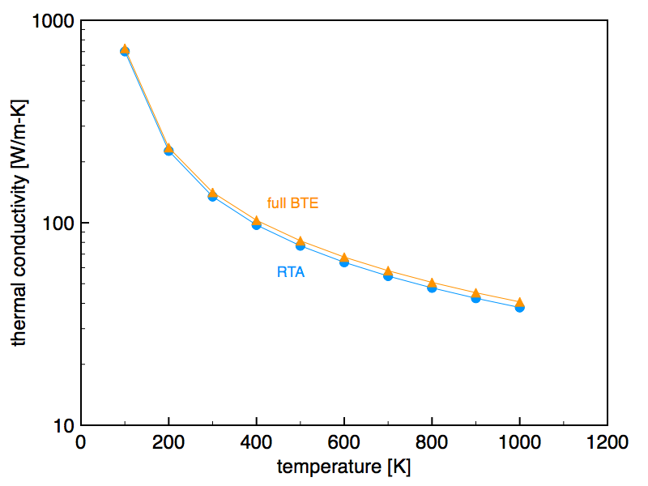
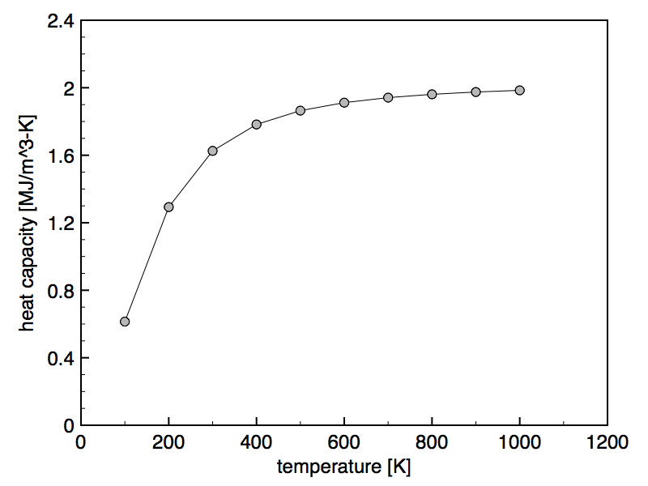

<a name="cumul"></a>
## Example input file for `cumulativecurves`

- Example: [Resolve phonon contributions to Si thermal conductivity and heat capacity.](#cumul_ex)

[Back to navigation](#toc)
***
<a name="cumul_ex">``cumulativecurves_example.xml`` : Resolve Si thermal conductivity and heat capacity by various phonon metrics.</a>

```xml
<cumulativecurves>

  <!-- OPTIONAL. Specifies path to H5 repository. -->
  <!-- Equals the launch directory when omitted. -->
  <H5repository root_directory=".."/>

  <!-- Specifies material information. -->
  <!-- Directory is relative to H5 repository directory. -->
  <compound directory="Si" base="Si" gridA="12" gridB="12" gridC="12"/>

  <!-- Cartesian vector along which to resolve conductivity. -->
  <transportAxis x="0" y="0" z="1"/>

  <!-- Select desired quantities -->
  <output conductivity="true" capacity="true"/>

  <!-- Select desired independent variables. -->
  <!-- MFP = mean free path; projMFP = MFP measured along transport axis; -->
  <!-- RT = relaxation time; freq = frequency (nu); -->
  <!-- angfreq = angular frequency (omega); energy = h*nu = hbar*omega -->
  <resolveby MFP="true" projMFP="true" RT="true" freq="true" angfreq="true" energy="true"/>

  <!-- OPTIONAL. Specifies number of points in each curve. (Default = 500). -->
  <optionalsettings curvepoints="500"/>

  <!-- OPTIONAL. Specifies desired directory for writing output. -->
  <!-- When omitted, directory will be created automatically. -->
  <!-- (Filenames are always generated automatically.) -->
  <!-- Directory is relative to launch directory. -->
  <target directory="examples_output/cumulativecurves/Si"/>

</cumulativecurves>
```
Plotting selected outputs generated by running this example without optional arguments (ambient temperature set at 300K) produces the following:

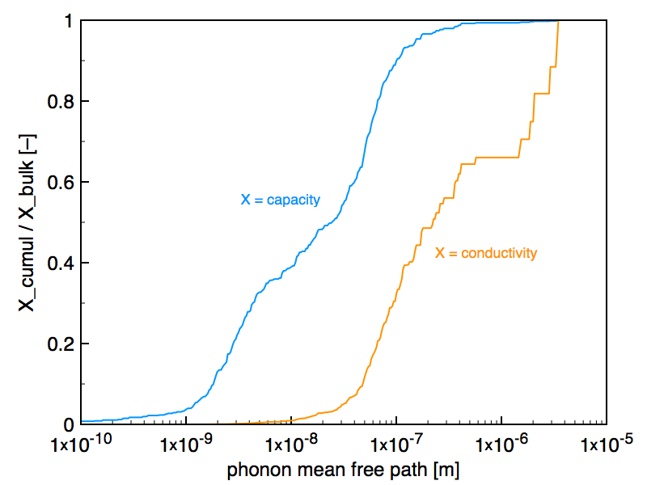
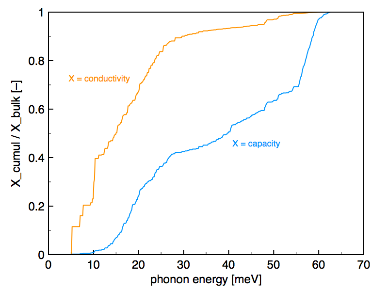

<a name="crossplane"></a>
## Example input file for `kappa_crossplanefilms`

- Example: [Obtain cross-plane conductivities for In<sub>0.53</sub>Ga<sub>0.47</sub>As films.](#crossplane_ex)

[Back to navigation](#toc)

***
<a name="crossplane_ex">``kappa_crossplanefilms_example.xml`` : Determine values and compact parametric form for cross-plane conductivity in In<sub>0.53</sub>Ga<sub>0.47</sub>As films.</a>

```xml
<crossplanefilmsweep>

  <!-- OPTIONAL. Specifies path to H5 repository. -->
  <!-- Equals the launch directory when omitted. -->
  <H5repository root_directory=".."/>

  <!-- Specifies material information. -->
  <!-- Directory is relative to H5 repository directory. -->
  <compound directory="InGaAs" base="In0.53Ga0.47As" gridA="12" gridB="12" gridC="12"/>

  <!-- Specifies sweep of film thicknesses. Type can be "log" or "lin". -->
  <sweep type="log" start="1e-9" stop="1e-4" points="51"/>

  <!-- Cartesian vector along the film normal. -->
  <transportAxis x="0" y="0" z="1"/>

  <!-- OPTIONAL. Determines parametric analytic form for cross-plane conductivity. -->
  <obtainCompactModel/>

  <!-- OPTIONAL. Specifies desired location for writing output. -->
  <!-- When omitted, directory and file names will be created automatically. -->
  <!-- Directory is relative to launch directory. -->
  <target directory="examples_output/kappa_crossplanefilms/InGaAs" file="AUTO"/>

</crossplanefilmsweep>
```

<a name="inplane"></a>
## Example input file for `kappa_inplanefilms`

- Example: [Obtain in-plane conductivities for In<sub>0.53</sub>Ga<sub>0.47</sub>As films.](#inplane_ex)

[Back to navigation](#toc)
***
<a name="inplane_ex">``kappa_inplanefilms_example.xml`` : Determine values for in-plane conductivity in In<sub>0.53</sub>Ga<sub>0.47</sub>As films.</a>

```xml
<inplanefilmsweep>

  <!-- OPTIONAL. Specifies path to H5 repository. -->
  <!-- Equals the launch directory when omitted. -->
  <H5repository root_directory=".."/>

  <!-- Specifies material information. -->
  <!-- Directory is relative to H5 repository directory. -->
  <compound directory="InGaAs" base="In0.53Ga0.47As" gridA="12" gridB="12" gridC="12"/>

  <!-- Specifies sweep of film thicknesses. Type can be "log" or "lin". -->
  <sweep type="log" start="1e-9" stop="1e-4" points="51"/>

  <!-- Cartesian vector along which the conductivity should be computed. -->
  <transportAxis x="1" y="0" z="0"/>

  <!-- Cartesian vector describing the film normal. -->
  <!-- Must be orthogonal to transportAxis. -->
  <normalAxis x="0" y="0" z="1"/>

  <!-- OPTIONAL. Sets specularity of film boundaries. -->
  <!-- Default value is 0, meaning fully diffuse boundary scattering. -->
  <specularity value="0.2"/>

  <!-- OPTIONAL. Specifies desired location for writing output. -->
  <!-- When omitted, directory and file names will be created automatically. -->
  <!-- Directory is relative to launch directory. -->
  <target directory="examples_output/kappa_inplanefilms/InGaAs" file="AUTO"/>

</inplanefilmsweep>
```
Plotting selected outputs generated by running the `kappa_crossplanefilms` and `kappa_inplanefilms` examples without optional argument (ambient temperature set at 300K) produces the following:

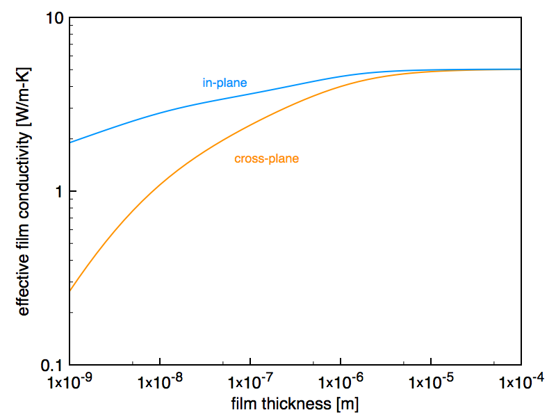

<a name="vrmc"></a>
## Example input files for `steady_montecarlo1d`

- Example 1: [Single-layer structure](#montecarlo_ex1)
- Example 2: [Multi-layer structure (only temperature profile)](#montecarlo_ex2)
- Example 3: [Multi-layer structure (additionally resolve spectral heat flux)](#montecarlo_ex3)
- Helper script: [Matlab/Octave script to visualise spectral heat flux as colormap](#montecarlo_script)
 
[Back to navigation](#toc)
***
<a name="montecarlo_ex1">``steady_montecarlo1d_example1.xml`` : Obtain temperature profile inside Si thin film.</a>

```xml
<!-- Illustrates Monte Carlo simulation of single layer structure. -->

<materials>

  <!-- OPTIONAL. Specifies path to H5 repository. -->
  <!-- Equals the current work directory when omitted. -->
  <H5repository root_directory=".."/>

  <!-- Specify information of all materials to be used in the simulation. -->
  <!-- Directory is relative to H5 repository directory. -->
  <material label="pureSi" directory="Si" compound="Si" gridA="12" gridB="12" gridC="12"/>

</materials>

<layers>

  <!-- Construct layer structure using the materials above. -->
  <!-- The index (starting from 1) specifies the order from "top" to "bottom". --> 
  <!-- Thicknesses are expressed in nm. -->
  <layer label="Si_slab" index="1" material="pureSi" thickness="200.0"/>

</layers>

<simulation>

  <!-- Set temperature differential, number of particles, and number of space bins. -->
  <!-- Reservoirs are set to Ttop = Tref + deltaT/2, Tbottom = Tref - deltaT/2. -->
  <!-- The reference temperature Tref is supplied as command line argument. -->
  <core deltaT="2.0" particles="1e6" bins="200"/>

  <!-- Set cartesian vector that describes the normal to the layer structure. -->
  <transportAxis x="0" y="0" z="1"/>

  <!-- OPTIONAL. Specifies location where to write temperature profiles. -->
  <!--           Directory is relative to current work directory. -->
  <target directory="examples_output/steady_montecarlo1d/example1"/>

</simulation>
```
Running this example without optional argument (ambient temperature set at 300K) produced the following results. *Note that numerical values will slightly vary each trial due to the inherently stochastic nature of Monte Carlo simulations.*

`basicproperties_300K.txt`

```
LAYER 1 pureSi (200 nm)
T_TOP 301 K
T_BOTTOM 299 K
T_REF 300 K
N_PARTICLES 1000000
HEAT_FLUX 533.53 MW/m^2
HEAT_FLUX_TOLERANCE 772.746 kW/m^2
EFF_CONDUCTIVITY 53.353 W/m-K
EFF_CONDUCTIVITY_TOLERANCE 0.0772746 W/m-K
EFF_RESISTIVITY 3.74862 nK-m^2/W
EFF_CONDUCTANCE 266.765 MW/K-m^2
```
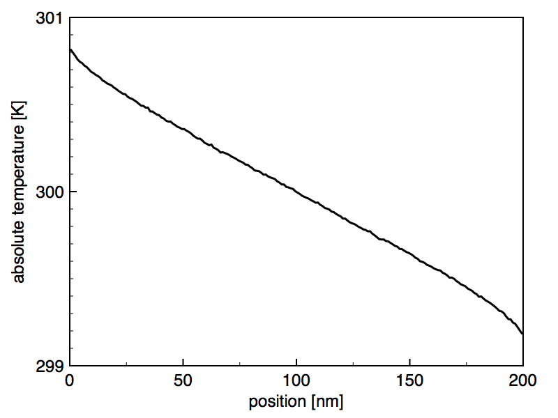

***
<a name="montecarlo_ex2">``steady_montecarlo1d_example2.xml`` : Obtain temperature profile inside Si/Ge/Si structure.</a>

```xml
<!-- Illustrates Monte Carlo simulation of multilayer structure. -->

<materials>

  <!-- OPTIONAL. Specifies path to H5 repository. -->
  <!-- Equals the current work directory when omitted. -->
  <H5repository root_directory=".."/>

  <!-- Specify information of all materials to be used in the simulation. -->
  <!-- Directory is relative to H5 repository directory. -->
  <material label="pureSi" directory="Si" compound="Si" gridA="12" gridB="12" gridC="12"/>
  <material label="pureGe" directory="Ge" compound="Ge" gridA="12" gridB="12" gridC="12"/>

</materials>

<layers>

  <!-- Construct layer structure using the materials above. -->
  <!-- The index (starting from 1) specifies the order from "top" to "bottom". -->
  <!-- Thicknesses are expressed in nm. -->
  <layer label="cap" index="1" material="pureSi" thickness="100.0"/>
  <layer label="device" index="2" material="pureGe" thickness="100.0"/>
  <layer label="substrate" index="3" material="pureSi" thickness="100.0"/>

</layers>

<simulation>

  <!-- Set temperature differential, number of particles, and number of space bins. -->
  <!-- Reservoirs are set to Ttop = Tref + deltaT/2, Tbottom = Tref - deltaT/2. -->
  <!-- The reference temperature Tref is supplied as command line argument. -->
  <core deltaT="2.0" particles="1e6" bins="300"/>

  <!-- Set cartesian vector that describes the normal to the layer structure. -->
  <transportAxis x="0" y="0" z="1"/>

  <!-- OPTIONAL. Specifies location where to write temperature profiles. -->
  <!--           Directory is relative to current work directory. -->
  <target directory="examples_output/steady_montecarlo1d/example2"/>

</simulation>
```
Running this example without optional argument (ambient temperature set at 300K) produced the following results. *Note that numerical values will slightly vary each trial due to the inherently stochastic nature of Monte Carlo simulations.*

`basicproperties_300K.txt`

```
LAYER 1 pureSi (100 nm)
LAYER 2 pureGe (100 nm)
LAYER 3 pureSi (100 nm)
T_TOP 301 K
T_BOTTOM 299 K
T_REF 300 K
N_PARTICLES 1000000
HEAT_FLUX 102.881 MW/m^2
HEAT_FLUX_TOLERANCE 242.053 kW/m^2
EFF_CONDUCTIVITY 15.4321 W/m-K
EFF_CONDUCTIVITY_TOLERANCE 0.036308 W/m-K
EFF_RESISTIVITY 19.4399 nK-m^2/W
EFF_CONDUCTANCE 51.4405 MW/K-m^2
```
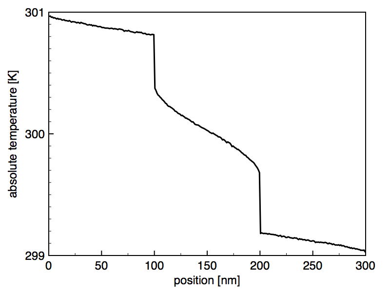
***
<a name="montecarlo_ex3">``steady_montecarlo1d_example3.xml`` : Obtain temperature profile and spectral heat flux (resolved by phonon angular frequency) inside Si/Ge/Si structure.</a>

```xml
<!-- Illustrates capabilities for resolving spectral heat flux. -->

<materials>

  <!-- OPTIONAL. Specifies path to H5 repository. -->
  <!-- Equals the current work directory when omitted. -->
  <H5repository root_directory=".."/>

  <!-- Specify information of all materials to be used in the simulation. -->
  <!-- Directory is relative to H5 repository directory. -->
  <material label="pureSi" directory="Si" compound="Si" gridA="12" gridB="12" gridC="12"/>
  <material label="pureGe" directory="Ge" compound="Ge" gridA="12" gridB="12" gridC="12"/>

</materials>

<layers>

  <!-- Construct layer structure using the materials above. -->
  <!-- The index (starting from 1) specifies the order from "top" to "bottom". -->
  <!-- Thicknesses are expressed in nm. -->
  <layer label="cap" index="1" material="pureSi" thickness="100.0"/>
  <layer label="device" index="2" material="pureGe" thickness="100.0"/>
  <layer label="substrate" index="3" material="pureSi" thickness="100.0"/>

</layers>

<simulation>

  <!-- Set temperature differential, number of particles, and number of space bins. -->
  <!-- Reservoirs are set to Ttop = Tref + deltaT/2, Tbottom = Tref - deltaT/2. -->
  <!-- The reference temperature Tref is supplied as command line argument. -->
  <core deltaT="2.0" particles="1e5" bins="300"/>

  <!-- Set cartesian vector that describes the normal to the layer structure. -->
  <transportAxis x="0" y="0" z="1"/>

  <!-- OPTIONAL. Specifies location where to write temperature profiles. -->
  <!--           Directory is relative to current work directory. -->
  <target directory="examples_output/steady_montecarlo1d/example3"/>

</simulation>

<spectralflux>
    
    <!-- Set number of phonon frequency bins -->
    <resolution frequencybins="200"/>

    <!-- Illustrates syntax to manually add locations at which the flux should be resolved -->
    <!-- <location position="50"/> -->
    <!-- <location position="150"/> -->
    <!-- <location position="250"/> -->

    <!-- Add a range of locations at which the flux should be resolved -->
    <!-- Locations are expressed in nm. -->
    <locationrange start="1" stop="299" step="1"/>
    
</spectralflux>
```
Running this example without optional argument (ambient temperature set at 300K) produced the following results. *Note that numerical values will slightly vary each trial due to the inherently stochastic nature of Monte Carlo simulations.*

`basicproperties_300K.txt`

```
LAYER 1 pureSi (100 nm)
LAYER 2 pureGe (100 nm)
LAYER 3 pureSi (100 nm)
T_TOP 301 K
T_BOTTOM 299 K
T_REF 300 K
N_PARTICLES 100000
HEAT_FLUX 102.18 MW/m^2
HEAT_FLUX_TOLERANCE 1.56173 MW/m^2
EFF_CONDUCTIVITY 15.327 W/m-K
EFF_CONDUCTIVITY_TOLERANCE 0.23426 W/m-K
EFF_RESISTIVITY 19.5734 nK-m^2/W
EFF_CONDUCTANCE 51.0899 MW/K-m^2
```
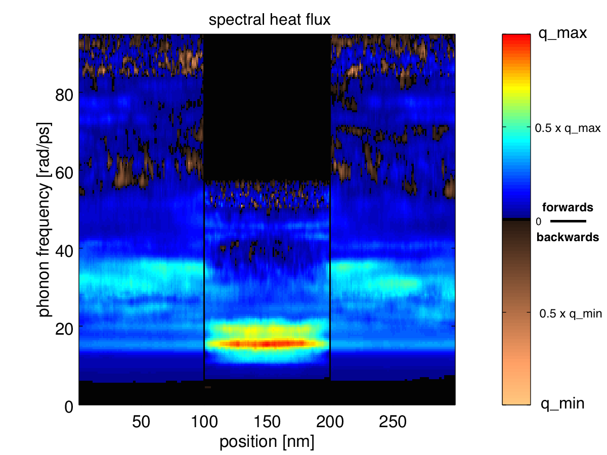
***
<a name="montecarlo_script">``make_colormap.m`` : `matlab` / `octave` script for visualising the spectral heat flux across space as a colormap.</a>

```
%Declare some variables

Nspace = 299;
Nbins = 200;
spacegrid = linspace(1,299,Nspace);
spaceunit = 'nm';
omegagrid = zeros(Nbins);
flux = zeros(Nbins,Nspace);
flux_plot = zeros(Nbins,Nspace);

%Read csv files

for nsurf=1:Nspace

  file = strcat('spectralflux_surface_',num2str(nsurf),'_300K.csv');
  disp(['Processing ' file]);
  fflush(stdout);
  data = csvread(file);
  flux(:,nsurf) = flipud(data(2:end,2));

  if(nsurf==1)
    omegagrid = flipud(data(2:end,1));
  endif

endfor

%Obtain color tables

figure;
imagesc(spacegrid,omegagrid,zeros(Nbins,Nspace));
colormap(jet)
colordata_buffer = colormap;
colordata_plus = colordata_buffer(1:56,1:3);
colormap(copper)
colordata_buffer = flipud(colormap);
colordata_minus = colordata_buffer(1:56,1:3);
close;

%Determine largest positive and negative heat fluxes

qmax = max(max(flux));
qmin = min(min(flux));
disp(['qmax = ' num2str(qmax)]);
disp(['qmin = ' num2str(qmin)]);

%Make rescaled versions of positive and negative data

for nrow=1:size(flux,1)
 for ncol=1:size(flux,2)
  if(flux(nrow,ncol)>=0) flux_plot(nrow,ncol) = flux(nrow,ncol)/qmax; endif
  if(flux(nrow,ncol)<0) flux_plot(nrow,ncol) = -abs(flux(nrow,ncol))/abs(qmin); endif
 endfor
endfor

% Make plot

imagesc(spacegrid,omegagrid,flux_plot);
set(gca,'Ydir','normal');
caxis([-1 1]);
colormap([colordata_minus;[0 0 0];colordata_plus]);
colorbar;
set(gca,'Fontsize',16);
xlabel(strcat('position [',spaceunit,']'));
ylabel('phonon frequency [rad/ps]');
saveas(gca,'colorplot.png');
```

<a name="vrmcpower"></a>
## Example input files for `steady_montecarlo1d_powersource`

- Example 1: [Single-layer structure](#montecarlo_power_ex1)
- Example 2: [Multi-layer structure (only temperature profile)](#montecarlo_power_ex2)
- Example 3: [Multi-layer structure (additionally resolve spectral heat flux)](#montecarlo_power_ex3)
 
[Back to navigation](#toc)
***
<a name="montecarlo_power_ex1">``steady_montecarlo1d_powermap_example1.xml`` : Obtain temperature profile inside Si thin film.</a>

```xml
<!-- Illustrates Monte Carlo simulation of single layer structure. -->

<materials>

  <!-- OPTIONAL. Specifies path to H5 repository. -->
  <!-- Equals the current work directory when omitted. -->
  <H5repository root_directory=".."/>

  <!-- Specify information of all materials to be used in the simulation. -->
  <!-- Directory is relative to H5 repository directory. -->
  <material label="pureSi" directory="Si" compound="Si" gridA="12" gridB="12" gridC="12"/>

</materials>

<layers>

  <!-- Construct layer structure using the materials above. -->
  <!-- The index (starting from 1) specifies the order from "top" to "bottom". --> 
  <!-- Thicknesses are expressed in nm. -->
  <layer label="Si_slab" index="1" material="pureSi" thickness="200.0"/>

</layers>

<simulation>

  <!-- Set ambient temperature, power density [W/m^2] of the source, -->
  <!-- number of particles and number of space bins. -->
  <core Tambient="300.0" powerdensity="1e8" particles="1e5" bins="200"/>

  <!-- Set cartesian vector that describes the normal to the layer structure. -->
  <transportAxis x="0" y="0" z="1"/>

  <!-- OPTIONAL. Specifies location where to write temperature profiles. -->
  <!--           Directory is relative to current work directory. -->
  <target directory="examples_output/steady_montecarlo1d_powersource/example1"/>

</simulation>
```
Running this example without optional argument (ambient temperature set at 300K) produced the following results. *Note that numerical values will slightly vary each trial due to the inherently stochastic nature of Monte Carlo simulations.*

`basicproperties_300K.txt`

```
LAYER 1 pureSi (200 nm)
T_AMBIENT 300 K
SOURCE_DISSIPATION 100 MW/m^2
N_PARTICLES 100000
DELTAT_SOURCE 0.398035 K
DELTAT_SOURCE_TOLERANCE 0.00190553 K
EFF_CONDUCTIVITY 50.2515 W/m-K
EFF_CONDUCTIVITY_TOLERANCE 0.240278 W/m-K
EFF_RESISTIVITY 3.97998 nK-m^2/W
EFF_CONDUCTANCE 251.257 MW/K-m^2
```
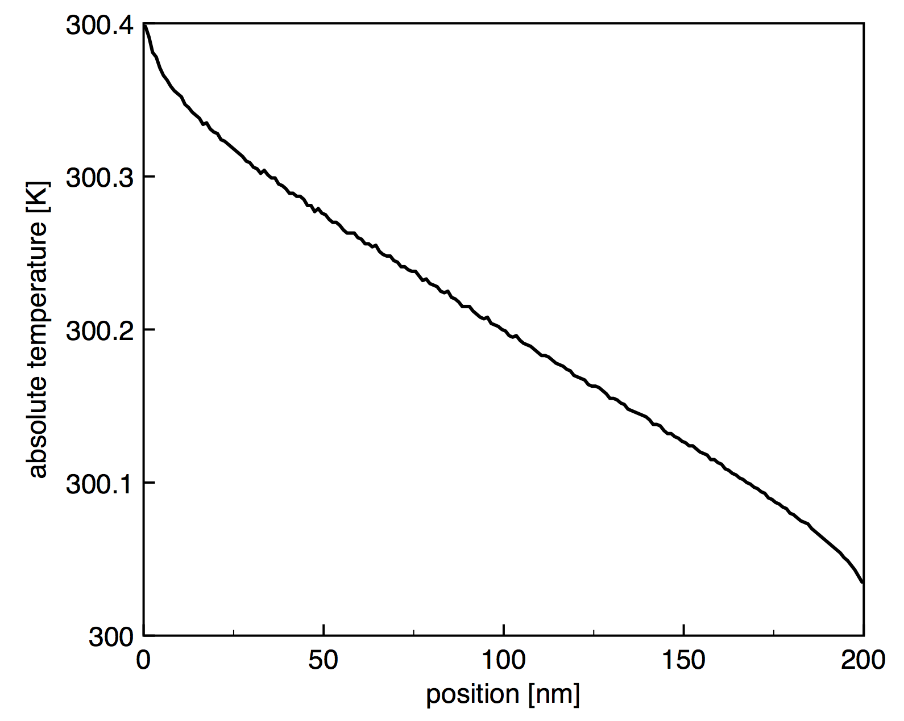

***
<a name="montecarlo_power_ex2">``steady_montecarlo1d_powersource_example2.xml`` : Obtain temperature profile inside Si/Ge/Si structure.</a>

```xml
<!-- Illustrates Monte Carlo simulation of multilayer structure. -->

<materials>

  <!-- OPTIONAL. Specifies path to H5 repository. -->
  <!-- Equals the current work directory when omitted. -->
  <H5repository root_directory=".."/>

  <!-- Specify information of all materials to be used in the simulation. -->
  <!-- Directory is relative to H5 repository directory. -->
  <material label="pureSi" directory="Si" compound="Si" gridA="12" gridB="12" gridC="12"/>
  <material label="pureGe" directory="Ge" compound="Ge" gridA="12" gridB="12" gridC="12"/>

</materials>

<layers>

  <!-- Construct layer structure using the materials above. -->
  <!-- The index (starting from 1) specifies the order from "top" to "bottom". -->
  <!-- Thicknesses are expressed in nm. -->
  <layer label="cap" index="1" material="pureSi" thickness="100.0"/>
  <layer label="device" index="2" material="pureGe" thickness="100.0"/>
  <layer label="substrate" index="3" material="pureSi" thickness="100.0"/>

</layers>

<simulation>

<!-- Set ambient temperature, power density [W/m^2] of the source, -->
<!-- number of particles and number of space bins. -->
<core Tambient="300.0" powerdensity="1e8" particles="1e5" bins="200"/>

  <!-- Set cartesian vector that describes the normal to the layer structure. -->
  <transportAxis x="0" y="0" z="1"/>

  <!-- OPTIONAL. Specifies location where to write temperature profiles. -->
  <!--           Directory is relative to current work directory. -->
  <target directory="examples_output/steady_montecarlo1d_powersource/example2"/>

</simulation>
```
Running this example without optional argument (ambient temperature set at 300K) produced the following results. *Note that numerical values will slightly vary each trial due to the inherently stochastic nature of Monte Carlo simulations.*

`basicproperties_300K.txt`

```
LAYER 1 pureSi (100 nm)
LAYER 2 pureGe (100 nm)
LAYER 3 pureSi (100 nm)
T_AMBIENT 300 K
SOURCE_DISSIPATION 100 MW/m^2
N_PARTICLES 100000
DELTAT_SOURCE 1.98269 K
DELTAT_SOURCE_TOLERANCE 0.00656331 K
EFF_CONDUCTIVITY 15.1316 W/m-K
EFF_CONDUCTIVITY_TOLERANCE 0.0500762 W/m-K
EFF_RESISTIVITY 19.8261 nK-m^2/W
EFF_CONDUCTANCE 50.4387 MW/K-m^2
```
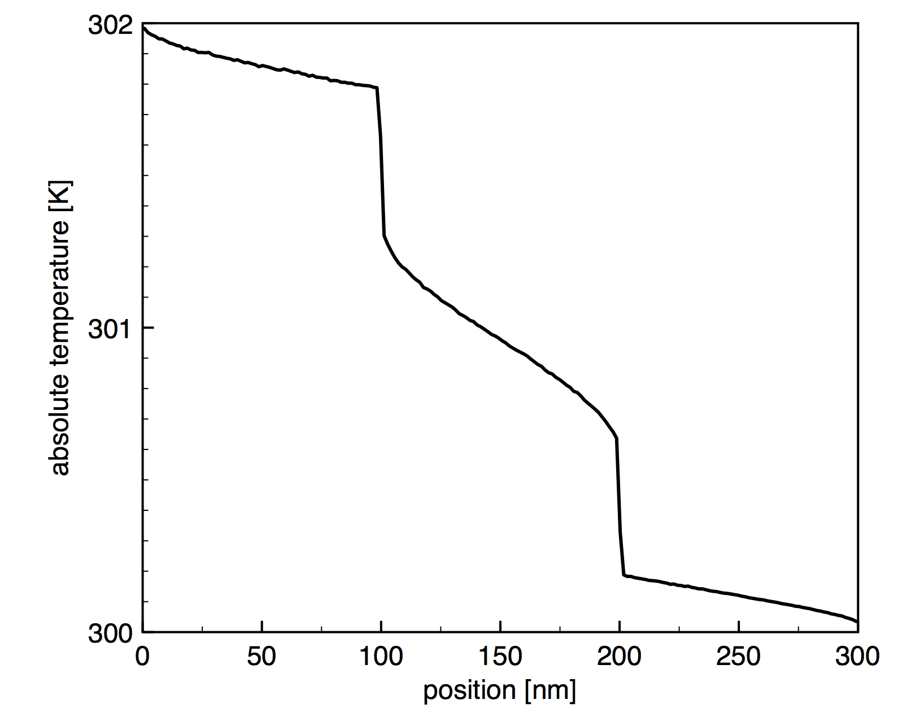
***
<a name="montecarlo_power_ex3">``steady_montecarlo1d_powersource_example3.xml`` : Obtain temperature profile and spectral heat flux (resolved by phonon angular frequency) inside Si/Ge/Si structure.</a>

```xml
<!-- Illustrates capabilities for resolving spectral heat flux. -->

<materials>

  <!-- OPTIONAL. Specifies path to H5 repository. -->
  <!-- Equals the current work directory when omitted. -->
  <H5repository root_directory=".."/>

  <!-- Specify information of all materials to be used in the simulation. -->
  <!-- Directory is relative to H5 repository directory. -->
  <material label="pureSi" directory="Si" compound="Si" gridA="12" gridB="12" gridC="12"/>
  <material label="pureGe" directory="Ge" compound="Ge" gridA="12" gridB="12" gridC="12"/>

</materials>

<layers>

  <!-- Construct layer structure using the materials above. -->
  <!-- The index (starting from 1) specifies the order from "top" to "bottom". -->
  <!-- Thicknesses are expressed in nm. -->
  <layer label="cap" index="1" material="pureSi" thickness="100.0"/>
  <layer label="device" index="2" material="pureGe" thickness="100.0"/>
  <layer label="substrate" index="3" material="pureSi" thickness="100.0"/>

</layers>

<simulation>

<!-- Set ambient temperature, power density [W/m^2] of the source, -->
<!-- number of particles and number of space bins. -->
<core Tambient="300.0" powerdensity="1e8" particles="1e4" bins="200"/>

  <!-- Set cartesian vector that describes the normal to the layer structure. -->
  <transportAxis x="0" y="0" z="1"/>

  <!-- OPTIONAL. Specifies location where to write temperature profiles. -->
  <!--           Directory is relative to current work directory. -->
  <target directory="examples_output/steady_montecarlo1d_powersource/example3"/>

</simulation>

<spectralflux>
    
    <!-- Set number of phonon frequency bins -->
    <resolution frequencybins="200"/>

    <!-- Illustrates syntax to manually add locations at which the flux should be resolved -->
    <!-- <location position="50"/> -->
    <!-- <location position="150"/> -->
    <!-- <location position="250"/> -->

    <!-- Add a range of locations at which the flux should be resolved -->
    <!-- Locations are expressed in nm. -->
    <locationrange start="1" stop="299" step="1"/>
    
</spectralflux>
```
Running this example without optional argument (ambient temperature set at 300K) produced the following results. *Note that numerical values will slightly vary each trial due to the inherently stochastic nature of Monte Carlo simulations.*

`basicproperties_300K.txt`

```
LAYER 1 pureSi (100 nm)
LAYER 2 pureGe (100 nm)
LAYER 3 pureSi (100 nm)
T_AMBIENT 300 K
SOURCE_DISSIPATION 100 MW/m^2
N_PARTICLES 10000
DELTAT_SOURCE 1.93148 K
DELTAT_SOURCE_TOLERANCE 0.0276022 K
EFF_CONDUCTIVITY 15.5452 W/m-K
EFF_CONDUCTIVITY_TOLERANCE 0.229505 W/m-K
EFF_RESISTIVITY 19.2985 nK-m^2/W
EFF_CONDUCTANCE 51.8175 MW/K-m^2
```


<a name="analytic"></a>
## Example input file for `transient_analytic1d`

- Example: [Analyse transient response of In<sub>0.53</sub>Ga<sub>0.47</sub>As.](#analytic_ex)

[Back to navigation](#toc)
***
<a name="analytic_ex">``transient_analytic1d_example.xml`` : Determine temperature profiles at specific times and transient evolution of source response and MSD for single-pulse input in In<sub>0.53</sub>Ga<sub>0.47</sub>As.</a>

```xml
<analytic1d>

  <!-- OPTIONAL. Specifies path to H5 repository. -->
  <!-- Equals the current work directory when omitted. -->
  <H5repository root_directory=".."/>

  <!-- Specifies material information. -->
  <!-- Directory is relative to H5 repository directory. -->
  <compound directory="InGaAs" base="In0.53Ga0.47As" gridA="12" gridB="12" gridC="12"/>

  <!-- Cartesian vector describing the thermal transport axis. -->
  <transportAxis x="0" y="0" z="1"/>

  <!-- Computes single pulse response T(x,t) versus space and time. -->
  <!-- The program will automatically choose an adaptive spatial grid. -->
  <!-- This example illustrates user-provided timelist functionality. -->
  <spacecurves spacepoints = "500" timepoints="{10e-9,30e-9,100e-9,300e-9,1e-6,3e-6,10e-6}"/>
  
  <!-- Alternatively, the program also supports automatic generation of timepoints. -->
  <!-- timesweep can be "log" or "lin". -->
  <!-- spacecurves spacepoints = "500" timesweep="log" tstart="10e-9" tstop="10e-6" timepoints="10"/>

  <!-- Computes temperature T(x=0) at the heat source versus time. -->
  <!-- timesweep can be "log" or "lin". -->
  <sourcetransient timesweep="log" tstart="1e-9" tstop="1e-4" points="101"/>

  <!-- Computes mean square displacement of thermal energy versus time. -->
  <!-- timesweep can be "log" or "lin". -->
  <MSD timesweep="log" tstart="1e-12" tstop="1e-6" points="121"/>

  <!-- OPTIONAL. Specifies desired directory for writing output. -->
  <!-- When omitted, directory will be created automatically. -->
  <!-- (Filenames are always created automatically.) -->
  <!-- Directory is relative to current work directory. -->
  <target directory="examples_output/transient_analytic1d/In0.53Ga0.47As"/>

</analytic1d>
```
Plotting selected output produced by running this example without optional argument (ambient temperature set at 300K) yields the following.

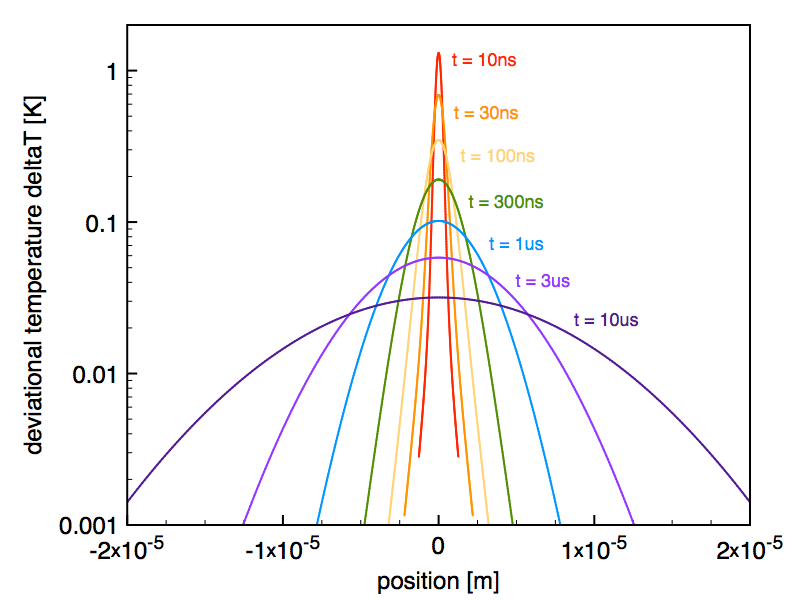

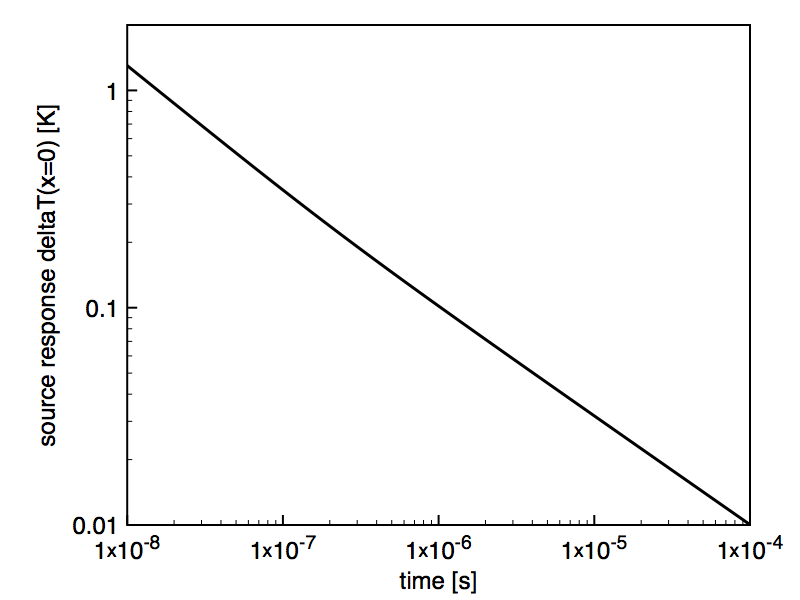

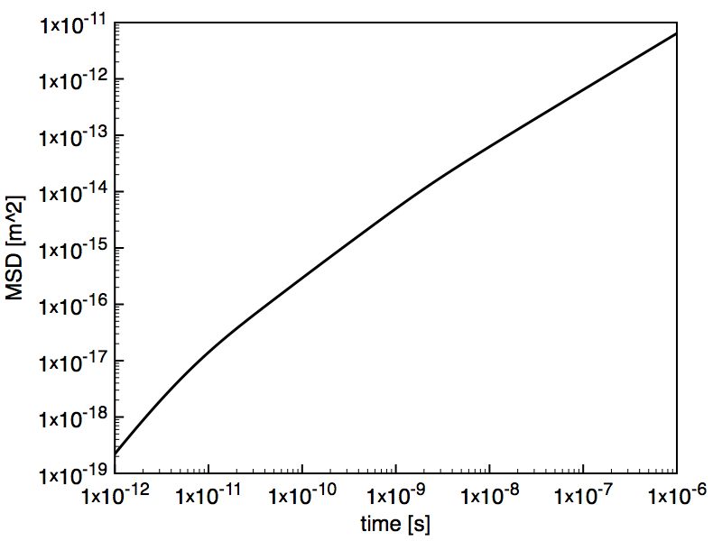

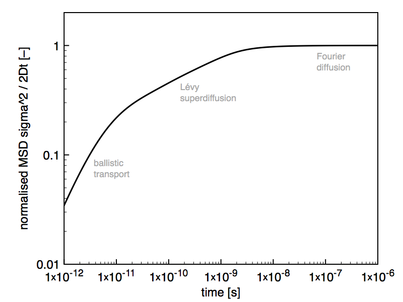